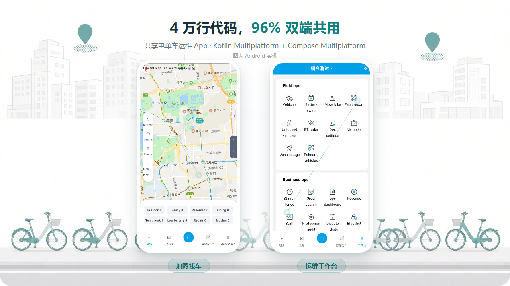
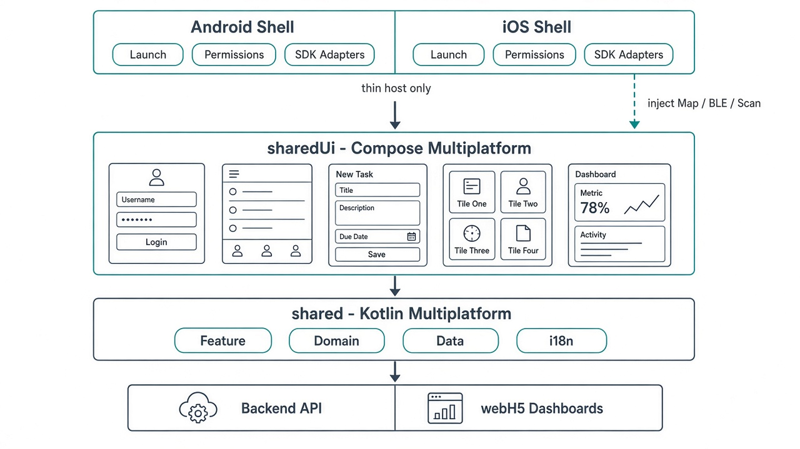
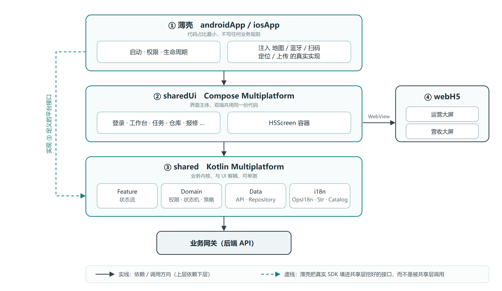
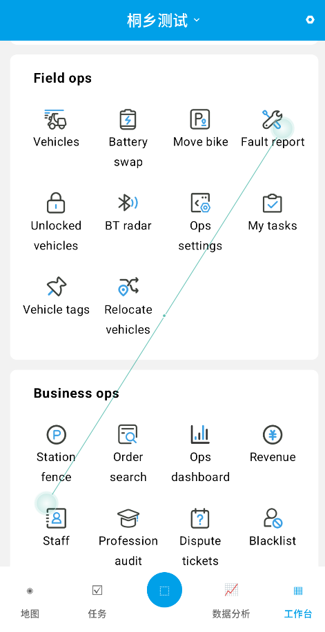

<!--
标题备选（发布时可换）：
1. 4 万行代码，96% 双端共用：共享电单车运维 App 的跨平台实战  ← 当前
2. 运维 App 不用写两遍：我们把 4 万行代码拆成「共享 96% + 宿主 4%」
3. 地图、蓝牙、扫码全都得碰原生，跨平台还能省多少？我们量了一下
4. 一套 Kotlin 代码写完运维 App 的业务和界面（源码已公开）
-->

# 4 万行代码，96% 双端共用：共享电单车运维 App 的跨平台实战



早上七点，运维员站在路边，面前是一排歪歪扭扭的共享电单车。

他要做的事很具体：打开 App 看哪台车没电、扫码开锁、换上满电电池、拍张照完单，再去下一个点。中间可能还要挪几台违停的车、处理一条用户举报、给一台坏车报修。一天下来，App 要被打开几十次，每次都在户外、单手、可能还戴着手套。

这就是共享电单车**运维端**的日常。它不性感，但它是这门生意的地面部队。

而站在技术这一侧，问题只有一个：**这套东西要不要在 Android 和 iOS 上各写一遍？**

我们的答案是不用。整个工程 4 万行 Kotlin，其中 **96% 放在双端共用的共享层**，剩下 4%（1,639 行）才是每多一个平台需要重写的部分。这篇文章把这个 96% 是怎么来的完整讲一遍——包括它一开始只有 81%，我们分两轮怎么推到 96%，以及每一轮里"搬不动"的借口是怎么被拆掉的。

> **源码已公开**：<https://github.com/wanghengwen/ebike-go>，工程在 `ebike-OpsApp/` 目录。文中所有模块名、文件名都能在仓库里对上。许可采用 Elastic License 2.0，属于**源码开放**（可自建自用、可修改），不等于 OSI 定义的开源，唯一限制是不能拿去做托管 / 代运营服务对外售卖。

---

## 一、先想清楚：这个 App 到底难在哪

很多人一听"跨平台"，第一反应是选框架。但框架是最后一步，第一步是**把需求称一称重**。

我们把运维端要做的四十来屏摊在桌上数了一遍，结论意外地清爽：

**第一类，纯业务界面。** 登录、选服务区、任务列表、完单表单、仓库出入库记录、报修类型选择、权限工作台、我的上报……这些屏的本质是「表单 + 列表 + 状态流转」，交互模式高度稳定，跟平台特性没什么关系。这一类占了**八成以上**。

**第二类，必须碰原生 SDK。** 数下来只有五个点：

- **地图** —— 车点渲染、聚合、围栏
- **蓝牙** —— 近场控车、蓝牙雷达找车
- **相机扫码** —— 扫车号、扫中控 IMEI
- **定位** —— 到点判定、轨迹上报
- **文件上传** —— 完单照片、报修图

就这五个。别的都不是。

这个"八二结构"直接决定了后面的所有选择。因为如果不先做这道题，很容易掉进两个坑：

**坑一：全都用原生写两遍。** 那四十屏表单，Android 写一遍、iOS 再写一遍，工作量翻倍、bug 翻倍，最要命的是**业务规则会分叉**——同一个"完单要不要拍照"的判断，两边各写一次，迟早不一样。运维员在 Android 上能完单、在 iOS 上完不了，这种问题排查起来极其耗人。

**坑二：全都用跨端框架写。** 表单确实省了，但地图和私有蓝牙 SDK 会把你按在 interop 的地上摩擦。尤其是私有 BLE SDK，闭源、只给 aar 和 framework，跨端框架的桥接层能让你写到怀疑人生。

所以我们没有二选一，而是**按"这块东西的难点在哪"来分配技术**。

---

## 二、选型：四条路，我们为什么选了第四条

选型时只问自己两个问题：

1. **业务界面能不能只写一份？**
2. **强平台能力能不能插拔，而不是被 UI 框架绑死？**

带着这两问过一遍候选方案：

| 方案 | 好处 | 代价 | 结论 |
|------|------|------|------|
| 双端各写原生 UI | 平台能力接得最直接 | 四十屏表单重复劳动，业务规则会分叉 | ❌ |
| Flutter / RN 全量跨端 | UI 一套搞定 | 地图与私有 BLE 桥接成本高，已有 Kotlin 资产断层 | ❌ |
| 只共享网络层，UI 全原生 | 上手最简单 | 省的是最不值钱的那部分，界面还是双份 | ❌ 不够 |
| **KMP 业务内核 + CMP 共享界面 + H5 大屏 + 平台能力接口化** | 业务和界面各写一份；SDK 可换；大屏独立迭代 | 要划清「共享界面 / 宿主 / H5」的边界 | ✅ |

最后的分工是这样的：

| 这部分 | 交给谁 | 为什么 |
|------|------|------|
| 业务界面（登录、任务、仓库、报修、工作台…） | **Compose Multiplatform** | 交互模式稳定，Material3 组件够用，收益最大风险最小 |
| 运营 / 营收大屏 | **H5（Vue3）** | 迭代节奏和现场作业完全不同，要能独立发版 |
| 地图 · 蓝牙 · 扫码 · 定位 · 上传 | **接口 + expect/actual** | 闭源 SDK 多、各端权限合规不同，只定契约不定实现 |
| 登录、权限、任务状态机、签名请求 | **KMP 共享内核** | 这是最不能分叉的部分，也最好写单测 |

三句话概括：

> **业务界面共享，平台能力接口化，数据大屏 Web 化。**

其中第二条最值得展开说。地图和蓝牙这类能力，正确的做法不是"找一个自带地图组件的跨端框架"，而是**在共享层定义契约，让宿主去填实现**。这样带来一个意外的好处：没有地图 Key、没有真机、没有私有 BLE SDK 的时候，塞一个模拟实现进去，除了真实控车之外的所有流程都能跑通——开发和演示不会被硬件卡住。这一点对开源版本尤其关键，因为私有 SDK 本来就不能进仓库。

---

## 三、最终架构



### 3.1 四层，从下往上看

**最底层是后端网关和 H5 站点。** 网络请求打到业务网关，两块大屏是独立的 Vue3 静态站点。

**第三层 `shared`，业务内核，Kotlin Multiplatform。** 四块内容：

- `Feature` —— 每个业务域的状态流和意图函数，向界面暴露状态，不暴露 Repository
- `Domain` —— 权限码、任务状态机、车控策略、校验规则
- `Data` —— API 定义、DTO、Mapper、Repository
- `i18n` —— 文案键与多语言目录

**第二层 `sharedUi`，界面主体，Compose Multiplatform。** 登录、工作台、任务、仓库、报修、报表入口这些屏都在这儿，写在 `commonMain`，双端共用同一份代码。

**最上层是两个宿主壳。** 这一层最容易被误解，单独讲。

### 3.2 最上面那层"壳"到底是什么

它**不是又一层 UI**，而是两个薄壳——Android 一个、iOS 一个。壳里只干三件事：

| 干什么 | 具体是什么 |
|---|---|
| **启动** | Android 的 `MainActivity` / `OpsApplication`、iOS 的 `OpsAppViewController`，把共享界面挂上去 |
| **写平台能力的实现本体** | 腾讯地图 View、CameraX 预览、定位前台服务、权限弹窗流程 |
| **注入** | 把上面这些实现，通过 CompositionLocal 塞进共享层定义好的契约 |

**壳里不写任何业务规则，也不画任何业务界面。** 完单条件、权限判断、状态流转，一行都不许出现在这层——这是我们守得最严的一条线。现在 Android 宿主的 `MainActivity` 全文 62 行，干的就是上表三件事，没有第四件。打个比方：共享层是发动机和变速箱，壳只是车壳加点火钥匙。

### 3.3 依赖方向



注意图里那条**青色虚线**：壳不是在"调用"内核的功能，而是在**填坑**——共享层挖好接口，壳把真实 SDK 填进去。这个方向搞反了，整套架构就复用不起来了。

### 3.4 模块结构

```text
ebike-OpsApp
├── shared/          # KMP：Feature · Domain · Data · 平台契约 · i18n
├── sharedUi/        # Compose Multiplatform：业务界面（含导航壳、登录、四 Tab、扫码屏）
├── androidApp/      # Android 宿主：启动 · 权限 · SDK 适配（1,639 行，无业务界面）
├── iosApp/          # iOS 宿主：链 SharedUi.framework，Swift 侧 27 行
├── webH5/           # Vue3：运营大屏、营收大屏
├── config/          # 多租户配置（仅 demo 入库，密钥本地提供）
└── docs/            # 架构、迁移、i18n、BLE、开源边界
```

### 3.5 那个 96% 是怎么算出来的

不玩虚的，直接数行数（`.kt` / `.swift` 文件，不含测试，不含空行）：

| 层 | 文件数 | 代码行 | 双端共用 |
|---|---:|---:|:---:|
| `shared`（业务内核） | 196 | 22,989 | ✅ |
| `sharedUi`（CMP 界面） | 62 | 14,833 | ✅ |
| `androidApp`（Android 宿主） | 16 | 1,639 | ❌ |
| `iosApp`（iOS 宿主，Swift） | 2 | 27 | ❌ |
| **合计** | **276** | **39,488** | **95.8% 共享** |

另外还有 `commonTest` 2,571 行（149 个测试用例，跑在共享层）和 `webH5` 5,070 行。

`sharedUi` 的 14,833 行里，只有 246 行在 `androidMain` / `iosMain`（WebView 本体、图标资源映射、中文排序），其余全在 `commonMain`。

### 3.6 从 81% 到 96%：两轮"搬不动"的借口

这一节值得单独写，因为它是这套架构最有说服力的一次自证。真正的收获不是那两个百分点，而是：**每次说"这块搬不动"，理由都不是技术，而是缺一个契约。**

#### 第一轮：81% → 88%，地图屏

写这篇文章的时候，Android 宿主有 **7,404 行**，比"薄壳"该有的体量大得多。当时我给的解释是："凡是画面里嵌着原生地图 View 的屏，都得留在宿主。"听起来天经地义。

后来我们把宿主逐个文件量了一遍，结论是这个解释站不住脚：

- 真正嵌 `AndroidView` 的只有两个文件，`TencentMapView`（321 行）和 `ReturnCarScatterMapView`（164 行）。
- 那五个"地图屏"——任务地图、挪车地图、换电地图、车况分布、还车分布——**一行 Android 代码都没有**，没有 `android.*` 导入，没有 Material2，没有 `ui.res`。
- 它们被钉在宿主里的唯一原因是：**直接调用了那两个 Composable**。
- 更讽刺的是 `SimulatorMapView`（155 行），纯 Compose `Canvas` 画的地图，用的还是 `shared` 里的投影和聚合算法，零平台依赖——它本来就该在共享层，却因为跟腾讯地图放在同一个目录里，一起被留在了 Android 侧。

所以问题不是"技术上不能搬"，而是**当时缺一个跨端的地图容器可以调**。

补这个容器只写了一百多行。照抄仓库里已经验证过的 `H5Screen` 思路：共享层定义契约，宿主注入实现。

```kotlin
// sharedUi/commonMain —— 参数全是共享层类型，所以契约能写在 commonMain
data class OpsMapSpec(
    val pins: List<MapPin> = emptyList(),
    val selectedCarId: String? = null,
    val fencePolygons: List<FencePolygon> = emptyList(),
    val trackPoints: List<TrackPoint> = emptyList(),
    // 视野控制用递增的 nonce，避免把 SDK 的相机对象泄进共享层
    val fitNonce: Int = 0,
    // …
)

interface OpsMapRenderer {
    @Composable fun Pins(spec: OpsMapSpec, modifier: Modifier)
    // 厂商没有散点能力就降级成普通车点图
    @Composable fun Scatter(spec: OpsScatterMapSpec, modifier: Modifier) { /* 默认实现 */ }
}

// 缺省是纯 Compose 画布，双端都能跑；宿主有 Key 才注入真实 SDK
val LocalOpsMapRenderer = staticCompositionLocalOf<OpsMapRenderer> { SimulatorMapRenderer }
```

宿主那边只剩 49 行胶水，把 spec 转给腾讯地图；顺便加了个 `LocalOpsToast`，把界面里的 `Toast` 换成"提示这句话"，具体用什么控件弹交给宿主。

搬完之后：

| | 迁移前 | 迁移后 |
|---|---:|---:|
| `sharedUi` | 9,779 | **12,668** |
| `androidApp` | 7,404 | **4,587** |
| 共享率 | 81.5% | **88.5%** |

八个屏进了共享层，宿主瘦了 38%。而且**顺手还少写了代码**：每个地图屏原来都有一段 `if (isTencent) TencentMapView(…) else SimulatorMapView(…)` 的重复 if/else，六处一起消失了。

两个细节值得说：

**一，`git mv` 之后大部分文件不用改。** 因为 `sharedUi` 和 `androidApp` 用的是同一套包名前缀，`com.luopingtech.ebike.ops.ui.task.ChangeBatteryMapScreen` 搬家之后全限定名没变，宿主的 import 一行都不用动。跨模块搬 UI 能这么轻，是包名规划早期就做对了的红利。

**二，验证靠机器，不靠自觉。** 搬完只要 `:sharedUi:compileCommonMainKotlinMetadata` 过得去，就说明这八个屏在 `commonMain` 里没有偷用任何平台 API。这比人工 review "看起来没问题"可靠得多。

#### 第二轮：88% → 96%，连导航壳一起搬

第一轮结束时宿主还剩 4,587 行，`MainActivity` 一个文件占 3,108 行。这回的借口是："这是导航壳——登录、四个 Tab、扫码浮层，它得知道 Activity，搬不走。"

同样的方法再量一遍，这个借口比上一个还虚。3,108 行里真正碰平台的只有这么几处：

| 平台耦合点 | 行数 | 为什么在宿主 |
|---|---:|---|
| `Activity` 类本身 | 27 | 真的只能在宿主 |
| 定位 / 通知权限申请 | 73 | `rememberLauncherForActivityResult` 是 Android 的 |
| 3 处相机预览 | 21 | 直接调了 CameraX 的 Composable |
| 2 处 `R.drawable`（手电筒、手输） | 4 | 直接引了 Android 资源 ID |
| 6 处 `Toast` | 12 | 直接调了 `android.widget.Toast` |

**加起来 137 行**，其余是纯 Compose 的业务界面。

顺手还量出 **1,063 行死代码**：`MainActivity` 里 432 行是被改版替换掉的旧任务界面和两个没人调用的 Composable，`sharedUi` 里还有两个第一轮搬过去、其实早就没人引用的旧地图屏（377 + 254 行）。它们一直跟着编译，却从来没被渲染过。全删。所以下面表格里 `sharedUi` 的增量是"搬进来的减去删掉的"。

补的契约还是那套配方，这次是两个。相机预览抄 `OpsMapRenderer`：

```kotlin
// sharedUi/commonMain：共享层只要「一块会吐出码的画面」
interface OpsScanPreview {
    @Composable fun Preview(modifier: Modifier, torchOn: Boolean, enabled: Boolean, onCode: (String) -> Unit)
}
// 宿主没接相机时不黑屏，明说这台设备扫不了
val LocalOpsScanPreview = staticCompositionLocalOf<OpsScanPreview> { UnavailableScanPreview }
```

权限这个更有意思，因为它逼着我们把"业务规则"和"平台流程"切开。Android 要分两次弹窗（先前台定位 + 通知，拿到了再哄用户去开"始终允许"，一起弹系统会直接拒），iOS 是 whenInUse / always 两档——这套流程没法共享。但**"拿到许可就开始上报轨迹"是业务规则**，必须共享。所以契约只留一句问答：

```kotlin
// sharedUi/commonMain：null = 可以开始上报，字符串 = 给用户看的提示
fun interface OpsTrackPermissionGate {
    fun request(onResult: (String?) -> Unit)
}

// MainShell 里的用法：谁去要权限不关心，拿到许可就开上报这条规则留在共享层
LaunchedEffect(homeState.session?.userId) {
    if (homeState.session == null || app.trackUploadFeature.state.value.enabled) return@LaunchedEffect
    trackPermissionGate.request { denied ->
        trackPermissionHint = denied
        if (denied == null) app.trackUploadFeature.setEnabled(true)
    }
}
```

然后把 `MainActivity` 按屏拆成 7 个文件搬进 `sharedUi/ui/shell/`，一共 2,689 行：`OpsAppRoot`（登录 / 设密码 / 选服务区）、`MainShell`（四十来个全屏页的开关和导航）、`MapTab`、`TasksTab`、`AnalysisTab`、`WorkbenchTab`、`ScanOverlay`。

搬完之后：

| | 第一轮后 | 第二轮后 |
|---|---:|---:|
| `sharedUi` | 12,668 | **14,833** |
| `androidApp` | 4,587 | **1,639** |
| `MainActivity` | 3,108 | **62** |
| 共享率 | 88.5% | **95.8%** |

宿主剩下的 1,639 行，构成非常干净：**1,442 行是平台能力的实现本体**（腾讯地图 534 · 相机扫码 358 · 定位与前台服务 262 · 权限流程 82 · 拍照 107 · 上传 67 · 逆地理 32），**197 行是启动与注入**（`OpsApplication` 135 + `MainActivity` 62）。

`MainActivity` 现在长这样，剩下的就是全部：

```kotlin
setContent {
    OpsTheme(branding = app.config.branding) {
        CompositionLocalProvider(
            LocalOpsMapRenderer provides opsMapRendererFor(app),
            LocalOpsScanPreview provides AndroidScanPreview,
            LocalOpsTrackPermissionGate provides rememberTrackPermissionGate(app),
            LocalOpsToast provides { msg: String -> Toast.makeText(this, msg, Toast.LENGTH_SHORT).show() },
        ) {
            Surface(modifier = Modifier.fillMaxSize()) { OpsAppRoot(app) }   // 界面全在共享层
        }
    }
}
```

有意思的是，第一轮结束时我们估过"真正非留不可的平台代码大约 1,400 行"——实际量出来 1,442 行。这个估算能对上，恰恰说明**"哪些代码必须留在宿主"是可以提前算清楚的**，不需要靠感觉。

#### 这轮改动对 iOS 意味着什么

这是重点。搬完之后，"iOS 宿主要做什么"从一份需求文档变成了一份**能数得清的清单**：一个入口函数加四个注入点。

```kotlin
// sharedUi/iosMain —— 和 Android 的 setContent 是同一件事
fun OpsAppViewController(app: OpsApp): UIViewController = ComposeUIViewController {
    OpsTheme(branding = app.config.branding) {
        Surface(modifier = Modifier.fillMaxSize()) { OpsAppRoot(app) }
    }
}
```

Swift 那边 27 行，一个 `UIViewControllerRepresentable` 就完了，**没有任何一屏是用 SwiftUI 重写的**。`SharedUi.framework` 里 `export(project(":shared"))`，所以 `import SharedUi` 连 `OpsApp` 一起带过来，只链一个 framework。

更关键的是**没填的坑不阻塞跑起来**：相机没接就显示"本宿主没接相机"，地图没接就用共享层那份 Canvas 画法，H5 屏显示占位。iOS 的待办于是从"照着 Android 把四十屏重写一遍"变成了四件具体的事：AVFoundation 取景、地图渲染器、`WKWebView`、HUD。这四件事加起来大概就是 Android 宿主那 1,442 行的量级。

### 3.7 接口化的能力清单

共享内核只认能力，不认厂商：

| 契约 | 干什么 | 谁来实现 |
|------|----------|--------|
| `MapCapability` | 判断地图能力是否就绪、是哪家 | 租户配置 + Key 决定 |
| `OpsMapRenderer` | 画车点 / 散点地图 | 腾讯地图 / 共享层的 Canvas 实现 |
| `BleTransport` | 近场控车、蓝牙雷达 | 私有 BLE SDK / 模拟实现 |
| `CodeScanner` | 独立扫码页取一个码 | CameraX + ML Kit |
| `OpsScanPreview` | 页内嵌的相机取景框 | CameraX 预览 / iOS AVFoundation 待补 |
| `LocationTracker` | 到点判定、轨迹上报、车辆重定位 | 系统定位 |
| `OpsTrackPermissionGate` | 问一句"现在能开始上报吗" | 各端自己的权限弹窗流程 |
| `MediaUploader` | 完单照片、报修图 | multipart 上传 / Demo 假实现 |
| `PlatformWebView` | H5 屏的 WebView 本体 | Android WebView / iOS `WKWebView` 待补 |
| `LocalOpsToast` | 一次性轻提示 | Android Toast / iOS HUD |

业务层通过这些接口完成"扫一下、传张图、响一声"，界面只管绑状态：加载中、失败文案、按钮能不能点。

这里有个规律：**契约的参数里不能出现任何厂商类型**。`OpsMapRenderer` 之所以能写在 `commonMain`，就是因为它收的全是 `MapPin`、`FencePolygon` 这些共享层模型，连"放大一级"这种相机操作都用一个递增的 `zoomInNonce` 表达，而不是把 SDK 的 camera 对象递进来。一旦签名里漏进一个 `LatLng`，这层契约就废了。

顺带说一句车控策略：`VehicleControlPolicy` 在 BLE 不可用时会自动回落到网络下发。这条规则写在 `shared` 里，双端行为天然一致——如果两边各写一遍，这种"回落时机"几乎必然会不一样。

### 3.8 H5 怎么嵌进 CMP

`sharedUi` 里有个跨端的 `H5Screen`：公共层管标题、加载失败重试、返回栈，`PlatformWebView` 在 androidMain / iosMain 各自实现（连返回键语义都不一样，索性各写各的）。大屏 URL 由租户配置加登录态拼出来，现场 App 和数据大屏彻底解耦发布。

---

## 四、国际化：一处改，双端生效

运维端经常要同时服务国内和海外租户，i18n 绕不开。

我们没有把文案散在两端的 `strings.xml` 和 `Localizable.strings` 里各维护一份——那意味着加一句话要改两个地方，而且漏了不会报错。做法是：**在共享层用类型安全的键 + 多语言目录，界面和网络共用同一个解析器。**

### 4.1 整条链路

```text
Str（枚举键，缺键在编译期 / 单测里就能发现）
   │
   ▼
StringCatalogs（ZH_CN / EN 各一套 Map）
   │
   ▼
OpsI18n.t(key, args…)
   │
   ├── Strings 全局委托 → Feature / Repository 不依赖 Compose 也能取文案
   └── LocaleContext.acceptLanguage → HTTP 请求头 Accept-Language
```

关键是**业务层也走同一套 `Strings.t()`**。这样 Toast、接口错误映射、Demo 假数据的语言和界面永远一致，不会出现"界面英文、报错中文"的尴尬。有个单测专门守着这件事：`Str` 里的每个键，中英两套目录都必须有值，缺一个就红。

### 4.2 切换语言的那一瞬间

用户在设置里点了 English：

1. `OpsI18n.setLanguage(...)` 更新内存里的语言
2. 写入 `SecureStore`（记住选择）
3. 更新 `LocaleContext.acceptLanguage`（下一个请求就带新语言）
4. `Strings.install(this)`，全进程解析器指向新目录
5. 界面侧 `collectAsState(languageFlow)`，文案**立刻刷新**

不用重启 App，不用重进页面。

### 4.3 默认语言：跟随系统

**首次启动跟随设备语言，用户手动选过就永远听用户的。** 这个优先级只有两条：

```kotlin
val lang = when {
    !stored.isNullOrBlank() -> OpsLanguage.fromTag(stored)          // 用户选过，用户说了算
    else -> OpsLanguage.fromSystemLanguage(systemLanguage ?: platformLanguageTag())
}
```

设备语言的读取本身就是一个 `expect/actual` ——正好又是一次"平台能力接口化"的实践：

```kotlin
// commonMain
expect fun platformLanguageTag(): String?

// androidMain
actual fun platformLanguageTag(): String? = Locale.getDefault().toLanguageTag()

// iosMain
actual fun platformLanguageTag(): String? = NSLocale.preferredLanguages.firstOrNull() as? String
```


### 4.4 加一门新语言要做什么

1. `OpsLanguage` 加枚举项和 `acceptLanguage`
2. `StringCatalogs` 加一套完整目录
3. 设置页语言列表加选项
4. （可选）H5 大屏 URL 带上 lang 参数

**不用**再动 Android 和 iOS 的资源文件——因为界面已经在共享层消费同一个 `t()` 了。这就是"一处改双端生效"的具体含义。

另外还有一个容易被忽略的细节：登录区号。出海就要处理国际手机号，我们内置了 Calling Codes 目录和区号选择器，提交时按 `+{区号}-{号码}` 规范化。它和界面语言相互独立，但同属"出海"这一包能力。

---

## 五、到今天做出了哪些能力

架构说完了，看实际交付的东西。下面这些全部跑在上面那套架构上。



**账号与作业准备**：密码 / 短信登录、多租户选分部、服务区选择、权限码驱动工作台入口显隐、中英文切换、国际区号。

**找车与控车**：车辆列表与地图、运维态与告警筛选、扫码解析、开关锁、响铃、开关电池仓（按策略走网络或 BLE）、电池 SN 绑定、车辆重新定位。

**任务与工单**：换电 / 挪车 / 巡检 / 维修任务的领取、执行、拍照完单、审核结果回看；自主挪车与批量人工挪车；巡检 / 维修旧工单台账（列表接单、完单）。

**报修与举报**：报修支持类型配置、停运选项、拍照提交、我的上报记录；用户举报支持末单校验、类型多选、可选照片、待审撤销。

**仓库与生产**：有码 / 无码出入库扫描与记录、车辆检测、中控绑定解绑、上下架、未关锁车辆排查、蓝牙雷达找车、运维员轨迹上报。

**数据大屏**：工作台一键打开运营 / 营收 H5。

一个额外收获是**行为对齐**。老系统的很多规则藏在细节里：低电量筛选到底看哪个状态码、"全部"筛选要不要包含已售罄的车、离线告警是看 `alarmState` 还是看连接状态、挪车完单要不要卡 200 米距离、报修车号最多几位。这些我们逐条对齐并写成了共享层的规则和单测。**规则只存在一份**，所以不存在"Android 对了 iOS 错了"这种问题。

---

## 六、坦白局：现在的真实进度和坑

技术文章最没意思的地方就是只报喜。这个项目现在有几个明确的短板，源码公开了也藏不住，不如自己说清楚：

**1. 私有 SDK 不在仓库里。** 私有蓝牙 SDK 是闭源的，地图 Key 也不能入库。仓库里给的是 `BleTransport` 接口加模拟实现，除真实控车之外的流程都能跑通。这是开源边界，也是刻意的设计：能力靠注入，缺了就降级，不影响编译。

**2. iOS 端从没编译过，一次都没有。** 96% 这个数字说的是"这些代码写在双端共用的源集里、并且通过了 `commonMain` 的编译校验"，不等于"iOS 上跑起来了"。手上没有 macOS，Apple target 的链接任务在 Windows 上根本不可用，`OpsAppViewController` 和 Swift 宿主是照着规范写的、没跑过。这一点不想含糊过去：**共享率是代码归属的度量，不是交付状态的度量。**

**3. iOS 有四个 `actual` 还是占位。** `WKWebView`（H5 屏）、AVFoundation 取景、地图渲染器、HUD 轻提示。占位不是空实现，是**看得见的占位**——比如 iOS 的 `PlatformWebView` 直接在界面上写"WebView is not implemented on iOS yet"。这是刻意的：手上没有 Mac，Kotlin/Native 的 ObjC interop 写出来编译不了也跑不了，而**未经验证却看着像对的代码，比一个明显的窟窿更危险**。

**4. Windows 上跑不了全套 `check`。** 兜底是 `compileCommonMainKotlinMetadata`——它在任何宿主上都会检查 `commonMain` 有没有偷用平台 API，谁在共享层里写了 `android.*`，当场编译失败。第二轮那 2,900 行界面搬进共享层，靠的就是这个任务把关，而不是人工 review "看起来没问题"。

---

## 七、想自己跑一下？

仓库：<https://github.com/wanghengwen/ebike-go>，工程目录 `ebike-OpsApp/`。

```bash
cd ebike-OpsApp
# JDK 17 或 21（25 不行，当前 Gradle Kotlin DSL 解析不了）
# Windows / Linux：共享层校验 + 单测 + Android 包
gradlew.bat :sharedUi:compileCommonMainKotlinMetadata :shared:testAndroidHostTest :androidApp:assembleDebug

# macOS 上还可以链 iOS framework（我们没验证过，见第六节）
# ./gradlew :sharedUi:linkDebugFrameworkIosSimulatorArm64 && cd iosApp && xcodegen generate
```

几个上手要点：

- 直接用 Android Studio 打开 `ebike-OpsApp`，跑 **androidApp** 的 Debug 配置就行。
- **不配任何后端也能跑**：`api.baseUrl` 留空即进入 Demo 模式，登录、任务、仓库、报修全流程走本地假数据，包括模拟的蓝牙响铃。想联调真实网关，复制 `androidApp/src/main/assets/tenant.json.example` 填上地址和密钥（该文件已 gitignore）。
- 地图 Key 写进本机 `local.properties`，不进版本库。
- 多租户配置在 `config/{tenant}_{mode}.json`，只有 demo 配置入库。

许可再说一次：**Elastic License 2.0**，源码开放，可自建自用、可改、可商用于自己的业务，唯一限制是不能把它作为托管 / 代运营服务对外提供。

---

## 八、给准备做同类 App 的几条建议

**1. 先数屏，再选框架。** 数清楚有多少屏是纯业务界面、多少屏必须碰硬件。这道题做完，框架的选择基本就是推论了。

**2. 平台能力第一天就做成接口。** 千万别在业务界面里直接 `new` 一个 SDK。第一天做接口的成本是半小时，第三个月再补是重构。

**3. 最该共享的不是界面，是规则。** 界面共享省的是工时，规则共享省的是"双端行为不一致"这类最难查的 bug。如果只能共享一层，选规则。

**4. 大屏和报表优先 H5。** 别把可视化的迭代速度绑进应用商店的审核队列。

**5. i18n 用共享键值目录**，让业务层和界面说同一种语言，网络头带上 `Accept-Language`，默认语言跟随系统。

**6. 留一个机器能执行的边界检查。** 我们靠 `compileCommonMainKotlinMetadata` 守住"共享层不许用平台 API"。任何靠自觉维持的架构约束，迟早会被赶工期的自己打破。

---

## 最后

做跨平台的运维 App，关键从来不是"选一个最火的跨端框架"，而是：

> **把大量业务界面放进 Compose Multiplatform，把地图 / 蓝牙 / 扫码留在可替换的接口背后，把数据大屏交给 H5，再用共享的业务内核和 i18n 把双端行为锁齐。**

当换电完单、仓库扫码、报修提交、语言切换都走同一套 `shared` + `sharedUi` 的时候，"跨平台"才从一句口号，变成一个真正能交给一线的现场工具。

源码在这儿，欢迎来拆：<https://github.com/wanghengwen/ebike-go>
