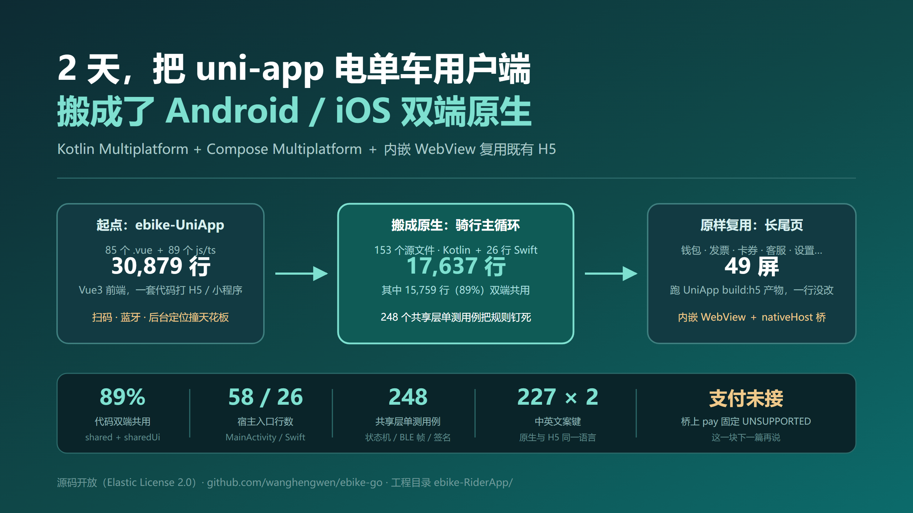
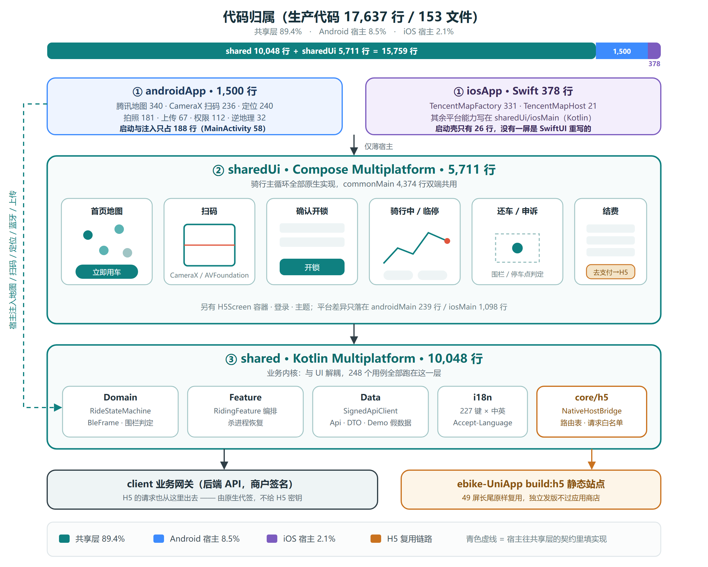
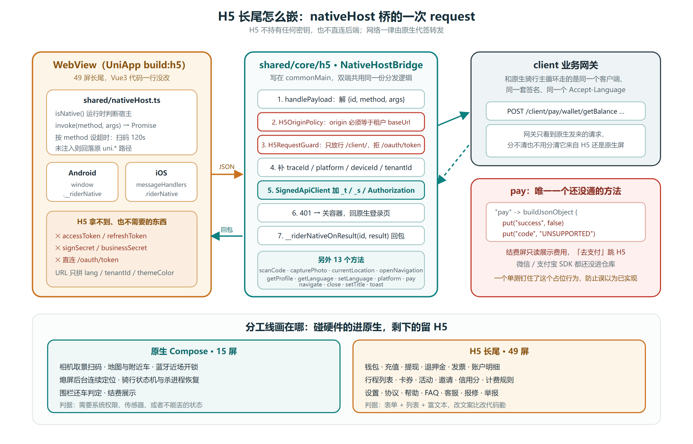

<!--
CSDN 发布备忘（图片已定稿，按此文件名上传）：
封面 / 头图：images/riderapp-hero.png
文内图 1：images/riderapp-architecture.png
文内图 2：images/riderapp-bridge.png
分类：移动开发 / Android
标签：Kotlin Multiplatform、Compose Multiplatform、跨平台、WebView、共享电单车、国际化
摘要：沿用运维端同一套 KMP + CMP，把 uni-app 用户端拆成「骑行主循环原生 + 49 屏长尾 H5」。AI 辅助 2 天完成功能移植（支付渠道对接除外），共享层约 89%，并做好中英 i18n。

标题备选（发布时可换）：
1. 2 天，把 uni-app 电单车用户端搬成了 Android / iOS 双端原生  ← 当前
2. 骑行走原生，49 屏长尾嵌 WebView：共享电单车 C 端跨平台实战
3. 地图、扫码、开锁必须碰原生，其余全部复用 H5：我们这样移植用户端
4. 1.7 万行 Kotlin，共享 ≈ 89%：共享电单车 Rider App 的跨平台实战
-->

# 2 天，把 uni-app 电单车用户端搬成了 Android / iOS 双端原生



晚上九点，用户在小区门口扫一辆共享电单车。

他要做的事也很具体：打开 App 看附近哪台车有电、扫码开锁、骑到目的地、临停或还车、看一眼费用。中间可能还要充值、开发票、报个修、翻一翻活动页。App 必须在弱网、地库、单手里都站得住。

这就是共享电单车**用户端**的日常。运维端是地面部队，用户端才是门面。

而站在技术这一侧，我们面对的不是一张白纸。仓库里已经有两份资产：

- `ebike-OpsApp`：Kotlin Multiplatform + Compose Multiplatform，运维端已经把「共享业务内核 + 薄宿主」跑通了。
- `ebike-UniApp`：Vue3 的用户端，一套代码打微信小程序、H5 和 App。业务页面齐全，但扫码、蓝牙近场开锁、熄屏后台定位，在跨端壳里经常撞天花板。

问题变成：**要不要把 UniApp 的八十多屏，用 Kotlin 再写一遍？**

我们的答案是不用。骑行主循环（地图、扫码、开锁、骑行、还车、结费）用和运维端同一套 KMP + CMP 重写；钱包、发票、卡券、客服、设置这些长尾，把 UniApp 打成 H5，嵌进 App 的 WebView。AI 辅助编程，**两天完成功能移植**——渠道支付对接除外，这一块商户资料和 SDK 审核本来就不是写代码能加速的。

整个 Rider 工程约 1.7 万行 Kotlin / Swift，**共享层（`shared` + `sharedUi`）约占 89%**。另外那 49 屏长尾，一行 Vue 都没改。

> **源码已公开**：<https://github.com/wanghengwen/ebike-go>，工程在 `ebike-RiderApp/`（原生）和 `ebike-UniApp/`（H5 长尾）。文中模块名、文件名都能在仓库里对上。许可采用 Elastic License 2.0，属于**源码开放**（可自建自用、可修改），不等于 OSI 定义的开源，唯一限制是不能拿去做托管 / 代运营服务对外售卖。运维端那篇姊妹文：[4 万行代码，共享 ≈ 90%：共享电单车运维 App 的跨平台实战](https://github.com/wanghengwen/ebike-go/blob/main/ebike-OpsApp/docs/%E5%A6%82%E4%BD%95%E5%AE%9E%E7%8E%B0%E8%B7%A8%E5%B9%B3%E5%8F%B0%E7%9A%84%E5%85%B1%E4%BA%AB%E7%94%B5%E5%8D%95%E8%BD%A6%E8%BF%90%E7%BB%B4APP.md)。

---

## 一、先想清楚：用户端到底难在哪

跨平台选型之前，先把页面分成两类。这道题做完，框架基本就是推论。

我们把 UniApp 的页面摊开数了一遍：

**第一类，必须碰原生 SDK。** 数下来就这几件事：

- **地图** —— 附近车辆、围栏、骑行轨迹
- **相机扫码** —— 扫车码开锁，弱光、反光、单手
- **蓝牙近场控车** —— 地库电梯口没公网时，只有 BLE 能开锁
- **后台定位** —— 骑行中熄屏也要连续上报，否则轨迹和围栏判定都是空的
- **支付** —— 微信 / 支付宝走系统级 SDK 和商户号，WebView 里 JSAPI 在独立 App 里经常走不通

这几件事决定了用户「能不能骑上、账能不能对上」。错一次就是客诉。

**第二类，表单 + 列表 + 富文本。** 钱包、充值、提现、退押金、发票、行程列表、卡券、活动、邀请、信用分、设置、协议、帮助、FAQ、客服、报修、举报……这一类占了页面数量的**七八成**，改文案比改代码勤，运营周周要动。

这个结构跟运维端刚好反过来。运维端是「四十屏表单 + 五个原生点」，所以把界面也放进 Compose Multiplatform 最划算。用户端如果把发票、活动、FAQ 也用 Compose 重写，两天根本做不完，而且后面每次运营改文案都要发版过审。

所以分工从一开始就定死了：

> **骑行主循环原生化，长尾 H5 化，平台能力接口化。**

支付本应落在第一类。渠道对接要 AppId、包名签名、商户进件，两天里做不完，于是契约先留着，桥上明确返回 `UNSUPPORTED`，结费屏只读展示费用。这一点后文坦白局会再写一次。

---

## 二、选型：为什么还是 KMP + CMP，而不是继续 UniApp

用户端已经有 UniApp 了，最省事的路是「继续打 App 包」。我们没走这条，是因为它在第一类需求上反复失手：

| 方案 | 好处 | 代价 | 结论 |
|------|------|------|------|
| 继续 UniApp 打 Android / iOS 包 | 页面不用搬 | 扫码、BLE、后台定位、支付都在壳层摩擦；双端行为靠条件编译分叉 | ❌ 正是这次要离开的原因 |
| Flutter / RN 全量重写 | UI 一套搞定 | 八十多屏重写，私有 BLE 与地图桥接成本高，已有 Kotlin / Vue 资产都断层 | ❌ |
| 双端各写原生 UI | 平台能力最直接 | 骑行规则会分叉；长尾页运营发版绑进应用商店 | ❌ |
| **KMP 骑行内核 + CMP 骑行界面 + UniApp H5 长尾 + 平台能力接口化** | 主循环一份代码；长尾不重写、可独立发版；SDK 可换 | 要划清「原生主循环 / 宿主 / H5」的边界 | ✅ |

运维端已经把第四条路走通了：`shared` 放业务内核，`sharedUi` 放 Compose 界面，Android / iOS 两个薄宿主只负责注入地图、相机、定位。用户端直接同构，包名换成 `com.luopingtech.ebike.rider`，类型前缀换成 `Rider*`。

跟运维端唯一的本质差异是：**用户端多了一条 H5 复用链路**。运维端嵌的是运营 / 营收大屏；用户端嵌的是自己那份 UniApp `build:h5` 产物——49 个 hash 路由，钱包到报修全在里面。

三句话概括：

> **主循环共享，长尾 Web 化，SDK 可插拔。**

两天能搬完，靠的就是这三句话，而不是把所有 `.vue` 翻译成 `.kt`。

---

## 三、最终架构



### 3.1 四层，从下往上看

**最底层是 client 业务网关，以及 UniApp 打出来的 H5 静态站点。** 原生骑行请求打网关；H5 的请求也打同一个网关——但由原生代签，H5 拿不到密钥。

**第三层 `shared`，业务内核，Kotlin Multiplatform。** 五块内容：

- `Feature` —— 认证、BLE 会话、骑行编排（`RidingFeature`），向界面暴露状态流
- `Domain` —— `RideStateMachine`、还车判定、BLE 帧、扫码解析、围栏提示
- `Data` —— 签名客户端、API / DTO / Demo 假数据
- `i18n` —— 类型安全的文案键 + 中英目录
- `core/h5` —— `NativeHostBridge`、origin 白名单、请求 path 守卫

**第二层 `sharedUi`，界面主体，Compose Multiplatform。** 登录、首页地图、扫码、确认开锁、骑行中、临停、还车、结费，全部写在 `commonMain`。H5 容器的标题栏、失败重试、返回栈也在这里；WebView 本体才分到 `androidMain` / `iosMain`。

**最上层是两个宿主壳。** 壳里不写业务规则，也不画业务界面。

### 3.2 壳里到底干什么

| 干什么 | 具体是什么 |
|---|---|
| **启动** | Android 的 `MainActivity` / `RiderApplication`、iOS 的 `RiderAppViewController`，把共享界面挂上去 |
| **写平台能力的实现本体** | 腾讯地图 View、CameraX 预览、定位前台服务、蓝牙 GATT、权限弹窗 |
| **注入** | 通过 CompositionLocal 把实现塞进共享层契约 |

Android 的 `MainActivity` 全文 58 行，干的就是上表三件事：

```kotlin
setContent {
    RiderTheme(branding = app.config.branding) {
        CompositionLocalProvider(
            LocalRiderMapRenderer provides riderMapRendererFor(app),
            LocalRiderScanPreview provides AndroidScanPreview,
            LocalRiderLocationPermissionGate provides rememberLocationPermissionGate(app),
            LocalRiderBlePermissionGate provides rememberBlePermissionGate(app),
            LocalRiderToast provides { message: String ->
                Toast.makeText(this, message, Toast.LENGTH_SHORT).show()
            },
        ) {
            Surface(modifier = Modifier.fillMaxSize()) {
                RiderAppRoot(app)
            }
        }
    }
}
```

iOS 更薄。Swift 侧一个 `UIViewControllerRepresentable` 把 `SharedUi.framework` 挂上去，**没有任何一屏是用 SwiftUI 重写的**：

```swift
struct ContentView: UIViewControllerRepresentable {
    let rider: RiderApp
    func makeUIViewController(context: Context) -> UIViewController {
        RiderAppViewControllerKt.RiderAppViewController(app: rider)
    }
    func updateUIViewController(_ uiViewController: UIViewController, context: Context) {}
}
```

### 3.3 模块结构

```text
ebike-RiderApp
├── shared/          # KMP：Feature · Domain · Data · 平台契约 · i18n · nativeHost 桥
├── sharedUi/        # Compose Multiplatform：登录、骑行 9 屏、首页地图、H5 容器
├── androidApp/      # Android 宿主：启动 · 权限 · 腾讯地图 · CameraX · 定位 · BLE
├── iosApp/          # iOS 宿主：链 SharedUi.framework，Swift 只桥 UIViewController
├── config/          # 多租户配置（仅 demo 入库，密钥本地提供）
└── docs/            # 架构、BLE 帧、签名、本文

ebike-UniApp         # 同一份 Vue3：小程序继续用；build:h5 给 Rider WebView 用
```

### 3.4 共享率怎么算

不玩虚的，直接数生产代码行数（`.kt` / `.swift`，不含测试，不含空行）：

| 层 | 文件数 | 代码行 | 双端共用 |
|---|---:|---:|:---:|
| `shared`（业务内核） | — | 10,048 | ✅ |
| `sharedUi`（CMP 界面） | — | 5,711 | ✅ |
| `androidApp`（Android 宿主） | — | 1,500 | ❌ |
| `iosApp`（iOS 宿主，Swift） | — | 378 | ❌ |
| **合计** | **153** | **17,637** | **89.4% 共享** |

`sharedUi` 里 commonMain 约 4,374 行双端共用；平台差异只落在 androidMain 239 行 / iosMain 1,098 行（iOS 的 MapKit、扫码、WebView 写在 Kotlin/Native，不写 SwiftUI）。共享层另有 **248 个单测用例**（状态机、BLE 帧、签名、桥、i18n）。

配图按 **共享 89.4% · Android 8.5% · iOS 2.1%** 示意。iOS 侧腾讯地图工厂在 Swift 里（闭源 QMapKit），所以 Swift 行数比运维端那 27 行多一截；界面仍然全部在共享层。

UniApp 侧 85 个 `.vue` + 89 个 js/ts，约 3 万行。这 3 万行没有消失——其中 49 屏作为 H5 被嵌进来，骑行主循环则被收成共享层里那份可单测的 Kotlin。

---

## 四、原生只做三件事：地图、扫码、骑行主循环

两天的工时必须花在「不能丢」的路径上。下面三块全部跑在 `shared` + `sharedUi`，宿主只填实现。

### 4.1 地图：共享层只认 `MapPin`，不认腾讯的 `LatLng`

抄运维端已经验证过的配方。契约写在 `commonMain`，参数全是共享层类型，缺省实现是纯 Compose Canvas，没有 Key 也能演示：

```kotlin
data class RiderMapSpec(
    val pins: List<MapPin> = emptyList(),
    val selectedCarId: String? = null,
    val fencePolygons: List<FencePolygon> = emptyList(),
    val trackPoints: List<TrackPoint> = emptyList(),
    val fitNonce: Int = 0,
    // …
)

interface RiderMapRenderer {
    @Composable fun Pins(spec: RiderMapSpec, modifier: Modifier)
}

val LocalRiderMapRenderer = staticCompositionLocalOf<RiderMapRenderer> { SimulatorMapRenderer }
```

宿主有腾讯 Key 就注入 `TencentMapView`；iOS 模拟器没有 QMapKit 的 slice，自动降级 MapKit。**契约签名里不能出现任何厂商类型**——连「放大一级」都用递增的 `zoomInNonce` 表达。一旦漏进一个 `LatLng`，这层就废了。

### 4.2 扫码：共享层只要「一块会吐出码的画面」

```kotlin
interface RiderScanPreview {
    @Composable fun Preview(
        modifier: Modifier,
        torchOn: Boolean,
        enabled: Boolean,
        onCode: (String) -> Unit,
    )
}
val LocalRiderScanPreview = staticCompositionLocalOf<RiderScanPreview> { UnavailableScanPreview }
```

Android 填 CameraX + ML Kit；没接相机时不黑屏，界面上写「本设备扫不了」。码值进 `ScanCodeParser`（对齐 UniApp 的车号 / IMEI 解析），再交给状态机，不在预览组件里写业务。

### 4.3 骑行状态机：从「散落的 ref」收到一份纯函数

UniApp 把骑行状态散在 `tempData.ride.status`、`getRideInfo().ridingState` 和各页面 `ref` 里。漏改一处就会出现「界面在骑行、store 说已结束」。这里收成单一 `RideSession`，转移只走 `reduce`：

```text
Idle → Scanning → Confirming → Unlocking → Riding → TempLocked → Returning → Settling
                                                                      └── SettleDone → Idle
```

两条刻意的设计，都是被线上事故教出来的：

1. **未定义的（相位, 事件）组合原样返回，不抛异常。** BLE 回调、`getRideInfo` 轮询和用户点击会并发到达，晚到的 ack 落在已经翻页的相位上属于常态。
2. **`Reset` 在骑行中被忽略。** 否则用户按「返回」就回首页，而车还开着。

状态机是纯函数：没有协程、没有时钟，时间戳一律由事件带进来，所以每条转移都能单测钉死。

解锁时序照搬 UniApp 的 `unlockByBle`，顺序反了会出「车响了但没订单」：

```text
ridePermission → BLE 0x2c(mute=true) → rideReport 建单 → PLAY_VOICE(START)
                                              │
                                        建单失败 → BLE lock 回滚
```

**静音下发、建单成功才播语音。** `UnlockPolicy` 默认 `BlePreferred`（地库电梯口只有蓝牙能用），失败降级网络；租户开了 `onlyBluetooth` 就走 `BleOnly`，跳过必然超时的那轮远程指令。这条策略写在 `shared` 里，双端行为天然一致。

杀进程恢复只信稳定相位：`Riding` / `TempLocked` / `Settling` 原样读回；`Unlocking` 退回 `Confirming`（请求已发、响应未确认，本地判不出车开没开）；`Scanning` 直接回 `Idle`（相机会话不可能跨进程）。随后 `getRideInfo` 的 `ServerSync` 以服务端为权威校正。

界面侧只有一个路由：`RideFlowHost` 按 `RidePhase` 切屏。相位可以被服务端轮询改写，用导航栈会出现「相位已回 Idle、界面还压着骑行页」。

这些规则才是两天里真正值钱的部分。AI 可以按 UniApp 的 TS 把 API path 和 Compose 屏铺出来；**哪些事件必须忽略、哪一步必须回滚，要人盯着对齐。**

---

## 五、其余 49 屏：UniApp 打成 H5，嵌进 WebView

这是用户端相对运维端多出来的那一刀，也是两天能搬完的关键。

钱包、发票、卡券、活动、帮助、报修这些屏，交互就是表单和列表，UniApp 里已经跑了很久。把它们用 Compose 重写，收益只是「统一技术栈」，代价是运营改一次文案就要发版。所以做法是：

```bash
cd ebike-UniApp
npm run build:h5:renren
# dist/build/h5/ 部署到 HTTPS CDN
# Rider 租户 config 写 h5.baseUrl，例如 https://cdn.example.com/h5/renren/index.html
```

App 里打开「我的钱包」实际加载的是：

```text
{h5.baseUrl}#/pages-sub/pay/wallet/wallet?lang=zh-CN&tenantId=2&themeColor=...
```

URL **只**拼 `lang` / `tenantId` / `themeColor`，绝不拼 token 和签名密钥。

### 5.1 nativeHost：H5 不直连后端



H5 跑在 WebView 里，但**不能自己签请求**。UniApp 侧用运行时 `isNative()` 判断，不要用 `#ifdef` 拆掉小程序路径——同一份代码继续给微信小程序用。

```ts
// ebike-UniApp/src/shared/nativeHost.ts
export function isNative(): boolean { /* 探测 window.__riderNative / messageHandlers.riderNative */ }

export type NativeHost = {
  request(config: NativeRequestConfig): Promise<Record<string, unknown>>
  getProfile(): Promise<NativeProfile>   // 展示字段，无 token
  pay(payload?: NativePayPayload): Promise<Record<string, unknown>>
  scanCode(): Promise<{ code?: string }>
  capturePhoto(): Promise<{ uri?: string }>
  currentLocation(): Promise<{ latitude?: number; longitude?: number }>
  getLanguage(): Promise<string>
  setLanguage(language: string): Promise<string>
  // navigate / close / setTitle / toast / openNavigation / platform
}
```

Android 挂 `window.__riderNative`，iOS 挂 `webkit.messageHandlers.riderNative`。两端把 `{id, method, args}` JSON 送到共享层的 `NativeHostBridge`，分发逻辑只写一份。

一次 `request` 的路径：

1. 解 payload
2. `H5OriginPolicy`：当前页 origin 必须等于租户 `h5.baseUrl`（`file://` 仅本地占位页）
3. `H5RequestGuard`：path 必须以 `/client/` 开头，拒绝 `/oauth/token`
4. 由原生补 `traceId` / `platform` / `deviceId` / `tenantId`
5. `SignedApiClient` 加 `_t` / `_s` / `Authorization`
6. 401 → 关容器，回原生登录页
7. `__riderNativeOnResult(id, result)` 回包

网关只看到原生发来的请求，分不清也不用分清它来自 H5 还是骑行屏。密钥和 accessToken **永不**进 H5 URL，也**不**出现在 `getProfile` 里。

### 5.2 容器怎么嵌，才不闪、不吃内存

`RiderAppRoot` 的策略很具体：

- 进首页**不**创建 WebView
- 第一次打开长尾页才挂 `H5HostScreen`
- 「关闭 / 回首页」只隐藏成 `0×0`，不拆掉容器，首页一直在底下
- 再次打开同一容器，按新的 kind / hash 跳转
- 文档基址（`#` 前）变化才 `loadUrl`，避免 SPA hash 把用户打回入口——运维端嵌大屏时踩过这个坑

返回键语义 Android 和 iOS 不一样，WebView 本体分 `androidMain` / `iosMain` 各写各的；公共层管标题、加载失败重试、返回栈。

### 5.3 分工线画在哪

| 原生 Compose · 约 15 屏 | H5 长尾 · 49 屏 |
|---|---|
| 相机取景扫码、地图与附近车、蓝牙近场开锁 | 钱包、充值、提现、退押金、发票、账户明细 |
| 熄屏后台连续定位、骑行状态机与杀进程恢复 | 行程列表、卡券、活动、邀请、信用分、计费规则 |
| 围栏还车判定、结费展示 | 设置、协议、帮助、FAQ、客服、报修、举报 |
| 判据：系统权限、传感器、或者不能丢的状态 | 判据：表单 + 列表 + 富文本，改文案比改代码勤 |

这不是「原生高级、H5 凑合」。这是按**变更频率和失败成本**切的。骑行规则分叉会出白骑和错账；活动页分叉只是文案隔一周。

---

## 六、国际化：原生和 H5 说同一种语言

用户端要出海，i18n 不能事后补。做法和运维端同一套：**共享层类型安全的键 + 多语言目录，界面、Toast、网络头、H5 容器共用一个解析器。** 当前 227 个键 × 中英两套目录，缺一个键 `RiderI18nTest` 就红。

### 6.1 整条链路

```text
Str（枚举键，缺键在编译期 / 单测里就能发现）
   │
   ▼
StringCatalogs（ZH_CN / EN 各一套 Map）
   │
   ▼
RiderI18n.t(key, args…)
   │
   ├── Strings 全局委托 → Feature / Repository 不依赖 Compose 也能取文案
   ├── LocaleContext.acceptLanguage → HTTP 请求头 Accept-Language
   └── nativeHost.getLanguage / setLanguage → H5 vue-i18n 对齐
```

业务层也走 `Strings.t()`。这样「余额不足」在原生弹窗、接口错误映射、H5 回包提示里永远是同一种语言，不会出现「界面英文、报错中文」。

### 6.2 切换语言的那一瞬间

用户在 H5 设置页点了 English：

1. UniApp `setLocale` + `nativeHost.setLanguage`
2. 原生 `RiderI18n.setLanguage(...)` 更新内存
3. 写入 `SecureStore`（记住选择）
4. 更新 `LocaleContext.acceptLanguage`（下一个请求就带新语言）
5. `Strings.install(this)`，全进程解析器指向新目录
6. 界面侧 `collectAsState(languageFlow)`，原生文案立刻刷新
7. 下次打开 H5，`App.vue` 的 `syncFromNativeHost()` 用 `getLanguage()` 覆盖 vue-i18n；URL 也带 `lang=`

不用重启 App。小程序路径不受影响：那边 `SUPPORTED_LOCALES.length === 1`，设置页根本不显示语言行。

### 6.3 默认语言：跟随系统

**首次启动跟随设备语言，用户手动选过就永远听用户的。**

```kotlin
val lang = when {
    !stored.isNullOrBlank() -> RiderLanguage.fromTag(stored)
    else -> RiderLanguage.fromSystemLanguage(systemLanguage ?: platformLanguageTag())
}
```

设备语言本身就是 `expect/actual`：

```kotlin
// commonMain
expect fun platformLanguageTag(): String?

// androidMain
actual fun platformLanguageTag(): String? =
    Locale.getDefault().toLanguageTag().takeIf { it.isNotBlank() && it != "und" }

// iosMain
actual fun platformLanguageTag(): String? =
    NSLocale.preferredLanguages.firstOrNull() as? String
```

登录区号和界面语言相互独立：出海要处理国际手机号，提交时按 `+{区号}-{号码}` 规范化。地图厂商也按租户切——国内腾讯，海外 `features.overseas` 时不走腾讯。**i18n、区号、地图供应商是三件独立的出海开关**，不要绑成一个「海外包」。

加一门新语言：枚举加项、目录补齐、设置页加选项、H5 `vue-i18n` 加一份 locale。不用再维护 `strings.xml` 和 `Localizable.strings` 各一份——原生界面已经在共享层消费同一个 `t()`。

---

## 七、两天是怎么拆的：AI 辅助，但边界是人定的

「两天移植」容易被听成营销。拆开看，工时能压下来是因为三件事事先成立，AI 只是把中间那段翻译做快了。

**事先成立的：**

1. 运维端已经把 KMP + CMP + 薄宿主跑通，Rider 同构拷贝，不用重新发明模块边界。
2. UniApp 的 API path、BLE 帧、还车 `returnType` 分支已经在线上验证过，Kotlin 侧是移植不是设计。
3. 长尾 49 屏决定不重写，H5 构建产物直接嵌。

**两天里 AI 真正加速的：**

- 按 UniApp 的 `api/` 把 `RidingApi` / `FenceApi` / DTO / Demo 假数据铺进 `shared/data`
- 把散落的骑行 `ref` 收成 `RideStateMachine` 的事件表，并补单测
- Compose 9 屏（扫码、确认、骑行、临停、找 P、引导、申诉、轨迹、结费）按现有 Material3 主题生成
- `H5ScreenKind` 路由表对齐 `pages.json`，`nativeHost.ts` 与 `NativeHostBridge` 成对实现
- `Str` + 中英目录随界面一起长，单测守缺键

**必须人盯着的：**

- BLE `resolveAck` 的怪语义（`len>1` 应答几乎总是 `code==0`）——「修好」会把真车弄坏
- 解锁「静音 → 建单 → 语音」的顺序和建单失败回滚
- 杀进程只恢复稳定相位，`Unlocking` 不能当已开锁
- H5 origin 白名单、path 只放行 `/client/`、profile 剥掉 token
- **支付不在两天范围里**：商户号、包名签名、微信开放平台审核，跟写 Kotlin 不是同一条队列

没有前面那条分工线，AI 会倾向于「把所有 `.vue` 翻译成 Compose」，两周也搬不完，而且搬完运营发版更慢。

---

## 八、到今天做出了哪些能力

**账号与启动**：手机号 + 验证码登录、Demo 模式（不配后端也能假骑一圈）、多租户配置、中英文切换、国际区号。

**找车与开锁**：首页地图（附近车辆 / 围栏）、扫码或手输车牌、预开锁确认、BLE 优先 + 网络降级、静音建单、失败回滚上锁。

**骑行中**：计时与费用展示、临停 / 恢复、寻车铃、头盔提醒、围栏提示、熄屏后台定位、杀进程后按稳定相位恢复。

**还车与结费**：`returnPermission` 判定（停车点 / 摄像头 / 禁停区 / 服务区外）、还车引导、申诉还车（拍照）、轨迹回看、结费明细只读展示。

**长尾（H5）**：钱包、充值、提现、退押金、发票、行程、卡券、活动、邀请、信用分、设置、协议、帮助、FAQ、客服、报修、举报、申请还车站——49 个 hash，独立发版不过应用商店。

一个额外收获是**行为对齐**。老系统很多规则藏在细节里：`ridingState` 3 是临停、4/5/6 是骑行中；开锁后首轮轮询缺字段不能当成订单结束；报修车号、还车距离、余额不足跳充值。这些写成共享层规则和单测之后，不存在「Android 对了 iOS 错了」。

---

## 九、坦白局：现在的真实进度和坑

技术文章最没意思的地方就是只报喜。源码公开了也藏不住，不如自己说清楚。

**1. 支付渠道对接未完成。** 这是标题里「除了支付对接」的那一块。结费屏可以展示费用明细；H5 桥上 `pay` 固定返回 `UNSUPPORTED`，有单测钉住这个占位，防止以后误以为已经实现。原生侧预留了 `WeChatPayLauncher` 这类契约——宿主没绑定、商户资料没配，调用方回退 H5，不挡编译、不挡联调。微信 / 支付宝的商户进件、开放平台、包名签名不在这两天里。

**2. 私有 SDK 与地图 Key 不在仓库里。** 腾讯 Key 写本机 `local.properties` 或租户 JSON；没有 Key 就走 Canvas 模拟地图。BLE 在仓库里是帧层 + `BluetoothGatt` / `CoreBluetooth` 实现 + Simulator。


---

## 十、想自己跑一下？

仓库：<https://github.com/wanghengwen/ebike-go>，工程目录 `ebike-RiderApp/`。

```bash
cd ebike-RiderApp
# JDK 17 或 21（25 不行，当前 Gradle Kotlin DSL 解析不了）
# Windows / Linux：共享层校验 + 单测 + Android 包
gradlew.bat verifyCommonMain :shared:testAndroidHostTest :androidApp:assembleDebug

# macOS 上还可以链 iOS framework（见 iosApp/README.md）
# ./gradlew :sharedUi:linkDebugFrameworkIosSimulatorArm64
# cd iosApp && bash bootstrap.sh sim && open RiderAppHost.xcworkspace
```

几个上手要点：

- 直接用 Android Studio 打开 `ebike-RiderApp`，跑 **androidApp** 的 Debug 配置。
- **不配任何后端也能跑**：`api.baseUrl` 留空即 Demo 模式，登录、假解锁、假还车、结费全流程走本地假数据。想联调真实网关，本机放 `config/{tenant}_{mode}.json`（该文件已 gitignore）。
- 地图 Key 写进本机 `local.properties` 的 `rider.map.tencentKey`，不进版本库。Demo 默认 `mapProvider=simulator`。
- H5 长尾：先按 `ebike-UniApp/docs/DEPLOY-H5.md` 把 `dist/build/h5/` 部署到 HTTPS，再在租户 JSON 里填完整 `h5.baseUrl`。空则 App 内只显示占位，不加载 WebView。
- 腾讯控制台按包名鉴权。Rider 默认包名 `com.luopingtech.ebike.rider.renren`，和运维端不是同一个，白屏时先查 Key 有没有加这个包名。

许可再说一次：**Elastic License 2.0**，源码开放，可自建自用、可改、可商用于自己的业务，唯一限制是不能把它作为托管 / 代运营服务对外提供。

---

## 十一、给准备做同类 App 的几条建议

**1. 先数屏，再决定哪些不搬。** 数清楚哪些屏失败成本高、哪些屏变更频率高。前者进原生共享层，后者留 H5。用户端和运维端的切法可以不一样。

**2. 有现成 Vue 就别假装没有。** 「技术栈统一」不是目标，「主循环行为一致、长尾能独立发版」才是。49 屏嵌 WebView，比 49 屏 Compose 重写便宜一个数量级。

**3. 平台能力第一天就做成接口。** 地图、扫码、定位、蓝牙、支付全部 `expect` 契约 + 宿主注入。没 Key、没真机、没商户号时塞模拟实现，除真实控车和真实扣款之外的流程都能跑通。

**4. 最该共享的是规则，不是控件。** 静音建单、杀进程恢复、还车判定码，这些写两遍迟早分叉。界面共享省工时，规则共享省客诉。

**5. H5 桥按安全默认值来，不要按方便。** origin 白名单、path 只放行业务前缀、profile 不含 token、密钥不下发。这些约束写成单测，比写在 wiki 里有用。

**6. i18n 从第一屏就走共享目录。** 业务层和界面同一个 `t()`，网络头带 `Accept-Language`，H5 通过桥同步语言。默认跟随系统，用户选过就听用户的。出海不是「再打一个英文包」。

**7. 留一个机器能执行的边界检查。** 我们靠 `verifyCommonMain` / `compileCommonMainKotlinMetadata` 守住「共享层不许用平台 API」。任何靠自觉维持的架构约束，迟早会被赶工期的自己打破。

**8. 让 AI 做翻译，人做边界。** 两天能搬完，是因为分工线事先画好。把「所有页面重写成 Compose」丢给 AI，得到的是又一个要维护的前端，不是一个能交给用户的 App。

---

## 最后

做跨平台的用户端 App，关键从来不是「选一个最火的跨端框架」，也不是「把旧前端全部消灭」，而是：

> **把扫码、地图、开锁、骑行这些不能丢的主循环放进 Compose Multiplatform，把钱包、发票、活动这些改得勤的长尾交给 UniApp 的 H5，再用共享的状态机、签名客户端和 i18n 把双端行为锁齐。**

当首页找车、扫码开锁、地库蓝牙、熄屏定位、还车判定、语言切换都走同一套 `shared` + `sharedUi`，而运营改活动页仍然只需更新 CDN 上那包 H5 的时候，「跨平台」才从一句口号，变成一个真正能交给用户的骑行工具。

支付对接是下一篇。源码在这儿，欢迎来拆：<https://github.com/wanghengwen/ebike-go>
